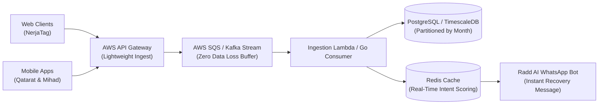

# Nerja AI: Event Tracking, Custom Tagging & Data Scaling Specification

**Author:** Technical & QA Architecture Lead  
**For:** Ammar Ahmed, Fahim Iqbal, Brother Zubair & Engineering Team  
**Date:** October 8, 2026  
**Status:** Approved Technical Architecture  

---

## 1. Context & Objectives

In our technical discussion with **Ammar Ahmed** and **Fahim Iqbal**, key questions were raised regarding how event tracking functions within **Nerja AI (`NerjaTag`)** and how to scale it across web and mobile platforms:
1. **Auto-Detection Reliability:** How does `NerjaTag` automatically recognize an "Add to Cart" or "Checkout" button without hardcoding?
2. **Custom Tagging Solution:** What if a non-standard website or custom CSS naming convention prevents the auto-detector from catching an event? How can developers add custom HTML tags?
3. **Manual Event Verification Dashboard:** How can admins or store owners review auto-captured events, verify accuracy, and filter out false positives?
4. **Mobile Apps (Qatarat & Mihad):** How do we unify tracking across Web and Mobile Apps (iOS/Android) while differentiating traffic sources?
5. **Database & Scale Architecture (For Brother Zubair):** How do we ingest and query millions of user interactions without database bottlenecks?

---

## 2. How `NerjaTag` Auto-Detects E-Commerce Events

The current client-side tracker injected into `<head>`:
```html
<script
  async
  src="https://f5976ye542.execute-api.ap-south-1.amazonaws.com/t.js?key=nak_pk_live_dBsm&api=https://9pl1zg5yte.execute-api.ap-south-1.amazonaws.com"
></script>
```

### Heuristic Decision Tree:
When a user interacts with the page, `NerjaTag` analyzes DOM mutations and click events against multi-layered heuristics:

1. **Text Content Matching (Multi-Lingual):**
   - **English:** `"Add to Cart"`, `"Add to Bag"`, `"Buy Now"`, `"Proceed to Checkout"`, `"Order Now"`, `"Subscribe"`.
   - **Arabic:** `"أضف إلى السلة"`, `"شراء الآن"`, `"إتمام الطلب"`, `"حجز الآن"`, `"طلب جديد"`.
2. **CSS Class & ID Patterns:**
   - Buttons or ancestors containing regex: `/(cart|add-to-cart|checkout|buy-now|order-btn|cta-purchase)/i`.
3. **Microdata & JSON-LD Extraction:**
   - Evaluates `itemprop="price"`, `itemprop="name"`, OpenGraph tags (`og:title`, `product:price:amount`), and active currency symbols (`SAR`, `USD`, `AED`, `LE`).

---

## 3. The Custom Tagging Solution (Client-Side HTML Attributes)

To eliminate any risk of missed events on custom themes, NerjaTag supports declarative HTML `data-*` attributes.

### Standard HTML Implementation:
```html
<!-- Example 1: Add to Cart Button with Custom Tag -->
<button 
  class="custom-theme-submit-btn"
  data-nerja-event="add_to_cart"
  data-nerja-item-id="PRD-109"
  data-nerja-item-name="Luxury Oudh Blend"
  data-nerja-price="350"
  data-nerja-currency="SAR"
  data-nerja-category="Fragrances"
>
  Order Special Edition
</button>

<!-- Example 2: Hospital / Clinic Appointment Booking -->
<button 
  class="btn-reserve-slot"
  data-nerja-event="book_appointment"
  data-nerja-doctor="Dr. Khalid Al-Mansoor"
  data-nerja-department="Cardiology"
  data-nerja-clinic-id="MED-JED-04"
>
  Confirm Doctor Consultation
</button>

<!-- Example 3: Hotel Room Reservation -->
<button 
  class="book-suite-btn"
  data-nerja-event="book_room"
  data-nerja-room-type="Executive Suite"
  data-nerja-nights="3"
  data-nerja-total-price="2400"
  data-nerja-currency="SAR"
>
  Reserve Suite
</button>
```

### Lightweight JavaScript API (For SPAs / React / Vue):
```javascript
// Direct programatic trigger if not using HTML tags:
window.Nerja && window.Nerja.track('add_to_cart', {
  productId: 'PRD-109',
  productName: 'Luxury Oudh Blend',
  price: 350.00,
  currency: 'SAR',
  source: 'web_storefront'
});
```

---

## 4. Manual Event Verification Workflow in Nerja Dashboard

As requested by Ammar, admins should be able to review captured events and confirm them manually.

```
┌────────────────────────────────────────────────────────────────────────┐
│                   NERJA AI: EVENT VERIFIER TABLE                       │
├───────────────┬────────────────────────────┬─────────────┬─────────────┤
│ Event Name    │ Triggered Element / URL    │ Status      │ Action      │
├───────────────┼────────────────────────────┼─────────────┼─────────────┤
│ add_to_cart   │ button.custom-theme-submit │ ⚠️ Pending  │ [Verify]    │
│ view_item     │ div.product-gallery-item   │ ✅ Verified │ [Disable]   │
│ misfire_click │ a.privacy-policy-link      │ ❌ Ignored  │ [Whitelist] │
└───────────────┴────────────────────────────┴─────────────┴─────────────┘
```

1. **Pending Status:** Newly discovered DOM clicks are flagged as `Pending Verification`.
2. **One-Click Whitelisting:** Clicking **Verify** binds the exact CSS path / selector permanently for that store.
3. **Noise Filtering:** Clicking **Ignore** drops similar interactions from entering the AI campaign trigger queue, protecting WhatsApp broadcast quotas.

---

## 5. Mobile App Tracking (Qatarat & Mihad Applications)

Both **Mihad** and **Qatarat** operate web and mobile applications (iOS / Android).

### Cross-Platform Payload Contract:
```json
{
  "event_id": "evt_7f8a91bc-04b3",
  "client_key": "nak_pk_live_dBsm",
  "app_id": "qatarat_mobile",
  "platform": "ios",
  "version": "2.4.1",
  "user_id": "usr_882910",
  "timestamp": "2026-10-08T11:04:12Z",
  "event_type": "add_to_cart",
  "payload": {
    "product_id": "QAT-WATER-20L",
    "quantity": 5,
    "unit_price": 18.00,
    "currency": "SAR",
    "delivery_city": "Jeddah"
  }
}
```

---

## 6. High-Volume Scaling & Database Architecture (For Brother Zubair)

High-volume interactions generate gigabytes of event data per day. To prevent database degradation:



### Key Database Optimizations:
1. **Asynchronous Buffer:** API Gateway immediately returns `202 Accepted` (<15ms latency) and pushes raw payloads to Amazon SQS / Apache Kafka. The primary database is never hit synchronously.
2. **Table Partitioning by Month:**
   ```sql
   CREATE TABLE nerja_events (
       id UUID NOT NULL,
       tenant_id VARCHAR(64) NOT NULL,
       event_type VARCHAR(64) NOT NULL,
       platform VARCHAR(32) NOT NULL,
       payload JSONB,
       created_at TIMESTAMPTZ NOT NULL,
       PRIMARY KEY (id, created_at)
   ) PARTITION BY RANGE (created_at);

   CREATE TABLE nerja_events_2026_10 PARTITION OF nerja_events
       FOR VALUES FROM ('2026-10-01') TO ('2026-11-01');
   ```
3. **Hot Storage (30-day window):** Kept in high-speed partitioned SSD storage for immediate intent calculation and WhatsApp retargeting.
4. **Cold Storage Archival:** After 30 days, aggregated data moves to Amazon S3 (Parquet format) for historical BI and AI model training at negligible storage cost.
